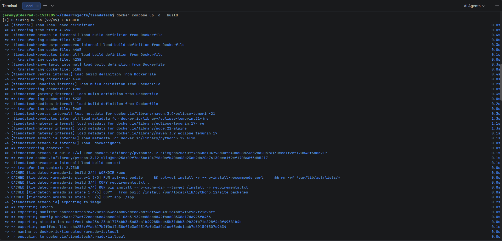
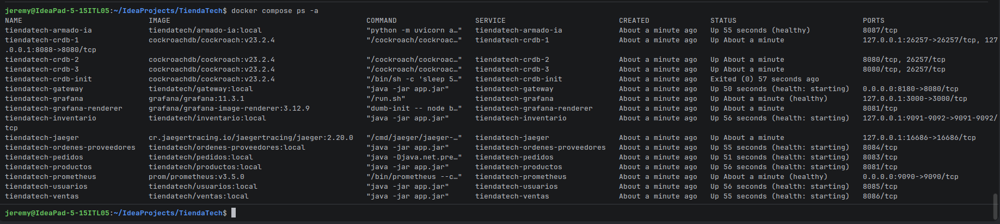
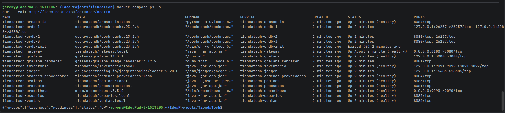

# Evidencia del arranque con un solo comando

Fecha de registro: 2026-09-07. Capturas proporcionadas por Jeremy desde su equipo
local (`jeremy@IdeaPad-5-15ITL05`), en la raíz del proyecto TiendaTech.

Requisito revisado: «Verificar que todo el sistema levante con un solo comando»
(punto 7 de la observación del docente).

## Comando de arranque

```bash
docker compose up -d --build
```

La captura muestra la construcción completada: `Building 86.3s (99/99) FINISHED`.
Se reutilizaron capas de caché durante la construcción.



## Inicialización

```bash
docker compose ps -a
```

En la primera consulta los contenedores están iniciados y varios servicios
todavía indican `health: starting`. El inicializador de CockroachDB aparece
como `Exited (0)`, que corresponde a una finalización correcta.



## Comprobación final

```bash
docker compose ps -a
curl --fail http://localhost:8180/actuator/health
```



| Componente | Resultado observado |
|---|---|
| Gateway y siete microservicios: usuarios, productos, inventario, pedidos, ventas, órdenes a proveedores y armado IA | `Up (healthy)` |
| CockroachDB: nodos 1, 2 y 3 | `Up` |
| Inicializador de CockroachDB | `Exited (0)` |
| Prometheus y Grafana | `Up (healthy)` |
| Jaeger y renderizador de Grafana | `Up` |
| Endpoint `/actuator/health` del gateway | `{"groups":["liveness","readiness"],"status":"UP"}` |

## Resultado y alcance

Las capturas demuestran el arranque con un solo comando del stack principal
definido en `docker-compose.yml` en el equipo de Jeremy, y la comprobación
posterior de salud del gateway y los siete microservicios.

Esta ejecución no documenta una clonación nueva ni la creación de volúmenes
vacíos, una compra completa o la reproducción en el equipo del docente. Tampoco
incluye el entorno experimental Spark del Compose separado ni el perfil opcional
Grafana Cloud. No se registró el commit exacto ejecutado en las capturas.

La [prueba anterior desde volúmenes limpios](../arranque-limpio-paso15.md)
documenta una ejecución distinta; sus condiciones no se atribuyen a estas fotos.
